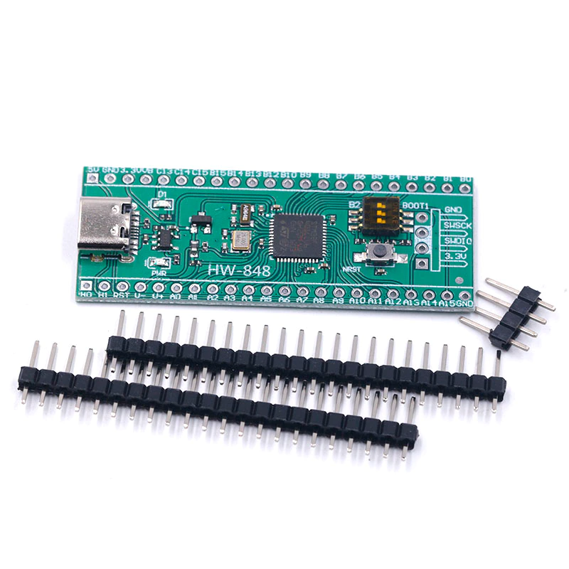

 

Исзодный проект для работы ROS через USB взят отсюда:
https://github.com/yltzdhbc/RosSerialVcp

Проект создан в IDE CLion 2021.2.1

Проект сгененрирован для платы:
Макетная плата STM32F401 STM32F401CCU6 
https://aliexpress.ru/item/4001116638841.html?spm=a2g2w.productlist.0.0.37c72184OQvChE&sku_id=10000014524553288

После чистки и переделки ссылок #include в проекте нормально 
откликается публикатор "kek" ROS при связи с RosSerial через USB

Консольная команда запуска RosSerial:
rosrun rosserial_python serial_node.py /dev/ttySTMusb

Консольная команда просмотра вывода публикатора RosSerial:
rostopic echo /kek 

